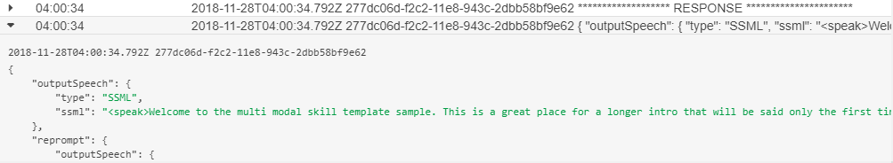

# LogResponseInterceptor

The LogResponseInterceptor writes the `response` object to a log. If there is no `response` object, then 'NONE' will be logged. 

## Usage

The LogResponseInterceptor has a constructor that requires a `Logger` passed in the constructor. This library includes the [ConsoleLogger](ConsoleLogger.md) that you can use. 

It is recommended that this be first response interceptor added.

## Examples

```ts
//TypeScript
import { LogResponseInterceptor, ConsoleLogger, ILogger } from "ask-community-interceptors";

const logger: ILogger = new ConsoleLogger();
const logResponseInterceptor = new LogResponseInterceptor(logger);

exports.handler = skillBuilder
    ...
    .addResponseInterceptors(logResponseInterceptor)
    .lambda();
```

```javascript
//JavaScript
const Interceptors = require('ask-community-interceptors');

const logger = new Interceptors.ConsoleLogger();
const logResponseInterceptor = new Interceptors.LogResponseInterceptor(logger);

exports.handler = skillBuilder
    ...
    .addResponseInterceptors(logResponseInterceptor)
    .lambda();
```

## CloudWatch Logs
If your skill is hosted in [AWS Lambda](https://aws.amazon.com/lambda/) then the LogResponseInterceptor will write two entries in the [Amazon CloudWatch](https://aws.amazon.com/cloudwatch/) Logs:

